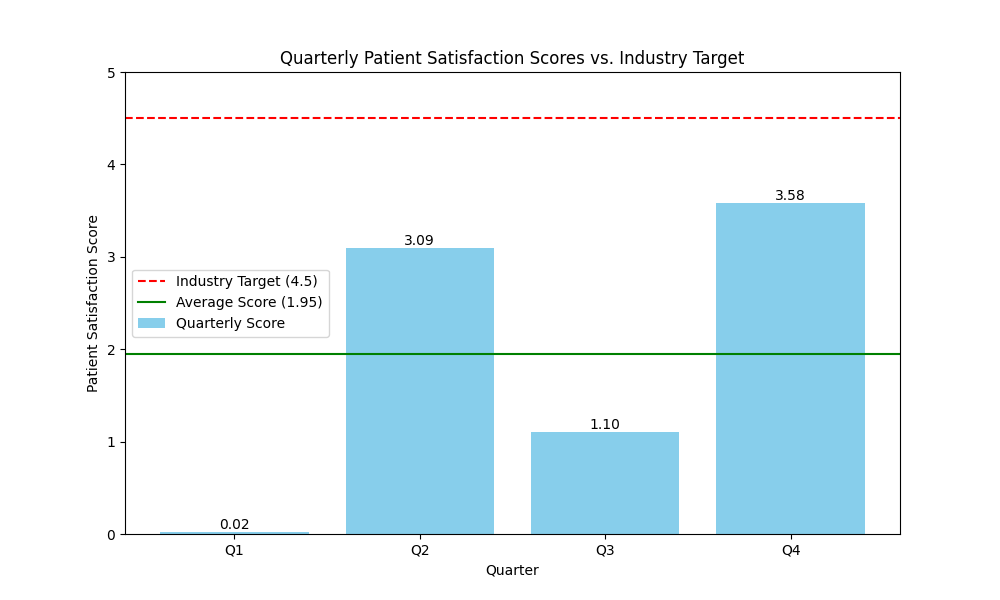

# Quarterly Patient Satisfaction Analysis

My email address: 24f1001694@ds.study.iitm.ac.in

This report provides an analysis of the patient satisfaction scores for the year 2024. The analysis is based on quarterly data, and the findings are benchmarked against the industry target.

## Performance Visualization

The following chart illustrates the quarterly patient satisfaction scores, the annual average, and the industry target.

## Key Findings

- **Quarterly Performance:** The patient satisfaction scores have shown significant volatility throughout the year, with scores of 0.02 in Q1, 3.09 in Q2, 1.1 in Q3, and 3.58 in Q4.
- **Average Score:** The average satisfaction score for the year is **1.95**, which is significantly below the industry target of 4.5.
- **Performance Gap:** There is a substantial gap of 2.55 between our average performance and the industry target.
- **Positive Trend:** Despite the low average, there is a positive trend from Q3 to Q4, indicating that recent initiatives might be having a positive impact.

## Business Implications

The low patient satisfaction scores pose a significant risk to our organization. Consistently underperforming against the industry benchmark can lead to:

- **Loss of Patients:** Patients may choose competitors with higher satisfaction ratings.
- **Damaged Reputation:** A poor reputation can deter new patients and make it difficult to attract and retain top talent.
- **Financial Impact:** Lower patient volumes and a damaged reputation can negatively impact revenue and profitability.

## Recommendations

To address the performance gap and achieve the target score of 4.5, we recommend focusing on the following areas:

1.  **Improve Service Quality:**
    -   **Staff Training:** Implement comprehensive customer service training for all patient-facing staff.
    -   **Personalized Care:** Encourage a more patient-centric approach, focusing on empathy and personalized care.
2.  **Reduce Wait Times:**
    -   **Process Optimization:** Analyze and streamline patient check-in, treatment, and check-out processes to reduce delays.
    -   **Staffing Levels:** Ensure appropriate staffing levels during peak hours to manage patient flow effectively.

By implementing these recommendations, we can enhance the patient experience, improve satisfaction scores, and ultimately strengthen our competitive position in the market.
